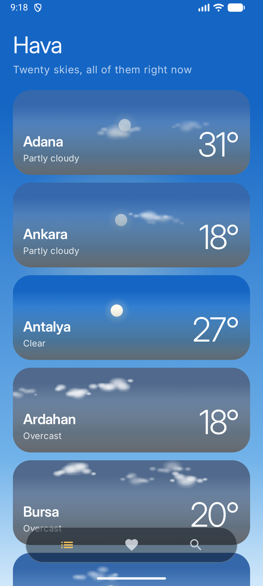
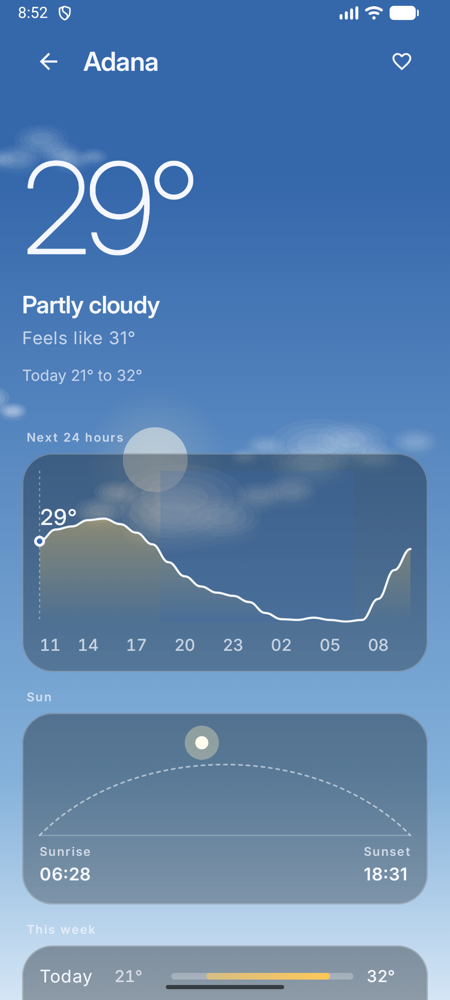
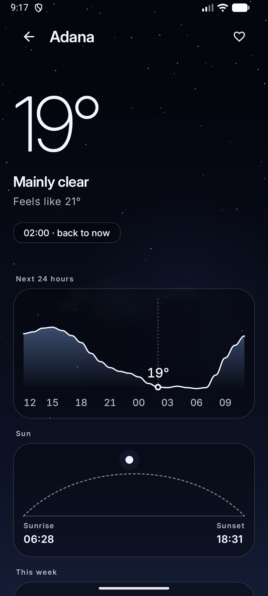
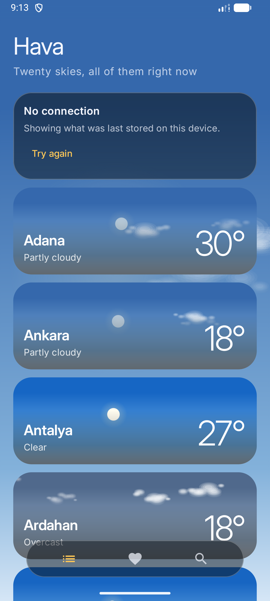
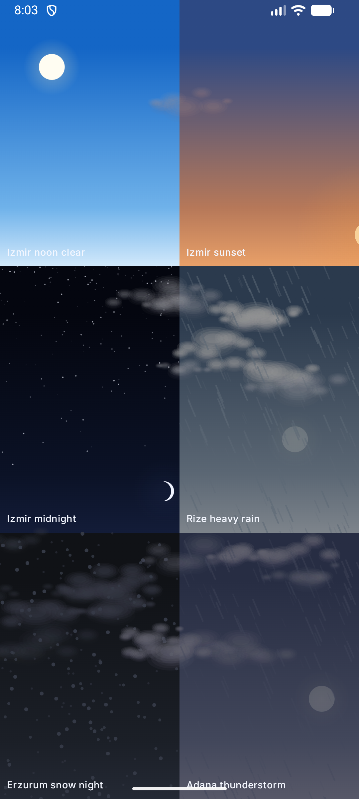

# Hava

A weather application for Android, built with Kotlin and Jetpack Compose.

The forecast comes from [Open-Meteo](https://open-meteo.com), which needs no API
key and no account. There is no backend of its own: everything the application
knows lives on the device, so it opens with weather on screen before the network
answers and keeps working when the network is gone.

*[Türkçe](README.tr.md)*

| The list | A city | Its night | With no connection |
| --- | --- | --- | --- |
|  |  |  |  |

## The idea

**The backdrop is the data.**

The sky behind every screen is computed from the weather at that place and the
real position of the sun, using the algorithm published by the NOAA Global
Monitoring Laboratory. The moon is placed by its phase and drawn with the shape
it actually has tonight. Nothing is a stock image and nothing is a preset: there
is no moment at which the application switches from one theme to another,
because there is no theme to switch to.

Two things follow from that, and they are the reason the rest of the code looks
the way it does.

**There are no weather icons. Anywhere.** A card in the list is already the sky
of that place, drawn from the same reading that produced the number beside it. A
small picture of a cloud on top of an actual cloud says nothing the card has not
said better. What is left for words is the part a picture is bad at, which is
how much of it there is, so the text says *heavy rain* rather than *rain*.

**The hourly curve can be dragged, and the world follows.** Moving along it
moves the hour the screen is seen under: the light, the height of the sun, the
stars, the rain. The forecast stops being a table and becomes a day that can be
walked through.



## Decisions worth reading

Each of these is recorded in full under [docs/decisions](docs/decisions).

| | |
| --- | --- |
| [Contrast is solved, not chosen](docs/decisions/0001-contrast-is-computed.md) | The palette is generated, so it cannot be approved once by eye. The pane that carries content is darkened by the least opacity that still reaches the guideline ratio over that particular sky. A test walks 10,752 generated palettes and fails if any loses legibility. |
| [The sun is computed, not faked](docs/decisions/0002-real-solar-position.md) | Sliding a disc between a reported sunrise and sunset is much less work and is wrong in every way a viewer can see. |
| [A forecast is stored as it arrived](docs/decisions/0003-store-the-response.md) | It is read as a whole and replaced as a whole, so normalising it would add a second way to turn the wire format into the domain. |
| [One sky, above navigation](docs/decisions/0004-one-ambient-sky.md) | Moving between screens should not restart the weather. |
| [Compiled against a released SDK](docs/decisions/0005-released-sdk-only.md) | The newest AndroidX requires an SDK that has not shipped. A repository that only builds on one machine is not a repository. |
| [The sky takes its time](docs/decisions/0006-the-sky-takes-its-time.md) | A change of weather is not a control answering a tap. Arriving somewhere new takes nearly two seconds; following a finger along the hourly curve takes a third of one. |

## Architecture

Thirteen modules, wired by convention plugins so that adding one does not mean
copying twenty lines of configuration that then drift apart.

```
app  ──────────────  the single Activity, navigation, the ambient sky
│
├── feature:cities      twenty places, each under its own sky
├── feature:detail      one place, hour by hour
├── feature:favorites   the places that were kept
├── feature:search      a place found by name
│
├── core:ui             the shared card, the words for a condition
├── core:sky            the backdrop: astronomy, palette, layers
├── core:designsystem   colour roles, type, motion, glass
├── core:data           repositories, offline first
├── core:network        Open-Meteo, and the only place the wire format is read
├── core:database       Room: places and the last forecast for each
├── core:common         dispatchers and the clock, both injected
└── core:model          the domain, in plain Kotlin with no Android types
```

Read [docs/ARCHITECTURE.md](docs/ARCHITECTURE.md) for how the layers talk to
each other and why the boundaries are where they are.

## What is verified

```bash
./gradlew test    # unit tests
./gradlew lint    # Android Lint, which fails the build on an error
```

The tests that carry the most weight are the ones that check arithmetic against
something other than a previous run.

- **The sun is checked against astronomy.** At its highest it reaches 90 degrees
  minus the difference between the latitude and the declination of the day, and
  it stands on the meridian. The arctic midsummer sun never sets, the southern
  midday sun stands to the north, and day and night are equal at the equator at
  the equinox.
- **The palette is checked for legibility** across four cities, four dates,
  every hour and every published weather code. That is 10,752 skies, and none of
  them may put content below the contrast threshold or need a pane opaque enough
  to hide the weather.
- **The forecast parser runs against a response captured from the live
  service**, not one written by hand, because a handwritten fixture only tests
  that the parser agrees with whoever wrote it.

## Building

```bash
./gradlew :app:assembleDebug
```

Requires JDK 17 or newer and Android SDK Platform 36. The Gradle toolchain pins
the compiler to JDK 21, so the output is the same on a workstation, on the build
server and on a second machine.

A release build is signed with a key that is never committed and is read either
from an ignored `keystore.properties` or from the environment. When neither is
present the release is signed with the debug key, so this repository can be
cloned and built into a working package by anyone. What they cannot produce is a
package that updates an installation of the real one.

## Releasing

Pushing a tag builds, tests, signs and publishes:

```bash
git tag v1.0.0 && git push --tags
```

The pipeline refuses to publish a tag that disagrees with the version declared
in `gradle.properties`. A release where the name people quote and the number a
device compares against have drifted apart is worse than no release.

## Accessibility

- Every card is one thing to a screen reader. Read out piece by piece it would
  be a name, then a number, then a word, with nothing to say they belong
  together.
- The setting that removes animation is read once in the theme and exposed to
  every component, so none of them can forget it. Because each layer of the sky
  is a function of one clock, stopping that clock leaves a correct still image
  rather than an empty one.
- Contrast is computed rather than assumed, and the computation is a test.

## Technology

| Concern | Choice |
| --- | --- |
| Language | Kotlin 2.4.20 |
| Interface | Jetpack Compose, Material 3 |
| Injection | Hilt |
| Network | Ktor with the platform engine, kotlinx.serialization |
| Storage | Room |
| Build | Gradle 9.8.0, Android Gradle Plugin 9.4.1, convention plugins |
| Minimum SDK | 26 (Android 8.0) |
| Compile SDK | 36 |

## Licence

MIT. See [LICENSE](LICENSE). The bundled Inter typeface is used under the SIL
Open Font License; its terms are in `core/designsystem/licenses`.
